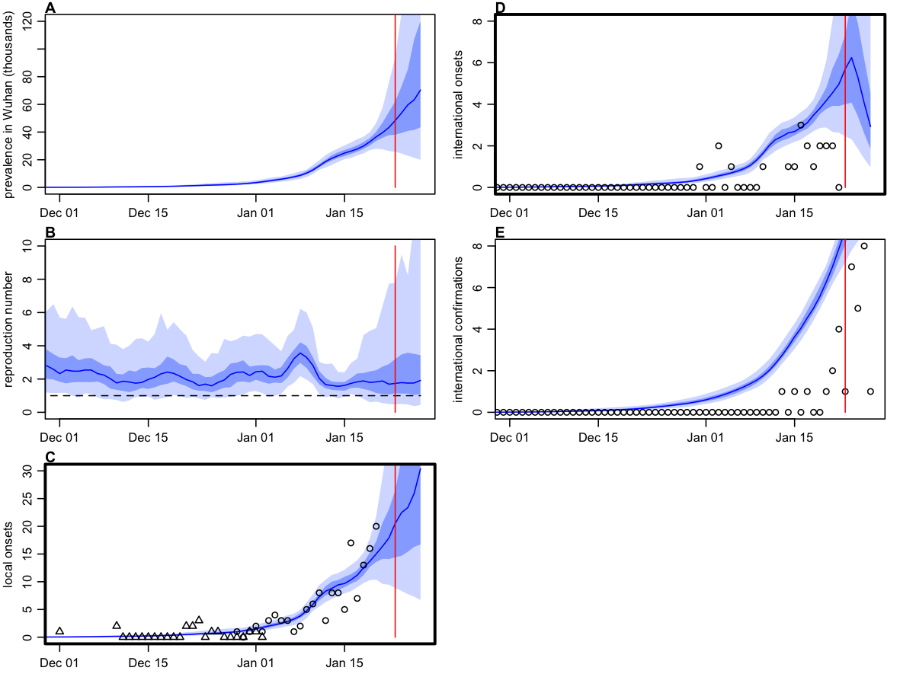

```{r setup, include=FALSE}
knitr::opts_chunk$set(echo = FALSE)
```

## Summary of results

We fitted a stochastic transmission model to temporal data on international exported cases from Wuhan to estimate the dynamics of transmission in Wuhan before travel restrictions were imposed on 23rd Jan. Export rate to different countries was weighted based on the [risk ranking by MOBS lab](https://www.mobs-lab.org/2019ncov.html) - WorldPop have a similar risk ranking (see [Table 5 here](https://www.worldpop.org/events/china)). We considered the 30 countries most at risk in the analysis. The model accounts for delays in symptom onset and reported (see methods below).

We estimated the reproduction had been growing prior to travel restrictions being imposed, and found strong evidence R>1 since at least late December. This growth estimate is driven by the increase in exported cases observed during 24-25th January. Our model suggests that exported cases from Wuhan will continue to be observed in the coming days, but decline. Despite stochastic transmission in the model, the estimated numbers of infections have become sufficiently large that the model followed broadly deterministic grow patterns in Wuhan since mid-January.

```{r fig_inference, echo=FALSE, fig.align='center', fig.cap="Dynamics of infection in Wuhan. A) Estimated prevalence of symptomatic cases over time. B) Estimated internationally exported cases from Wuhan (blue) along with reported cases by data of confirmation (black). C) Estimated reproduction number over time.  Blue lines and shaded regions show median, 50% CrI and 95% CrI.", out.width = '40%'}

```

## Methods

#### Methods

We used a stochastic SEIR model implemented using the Euler-Maruyama algorithm with a 6hr timestep, with transmission rate following geometric brownian motion (i.e. dlog(beta) = s dBt, where s is the volatility of transmission over time). We assume no travel out of Wuhan occurs after 23rd Jan, when restrictions were put in place.

```{r fig_schematic, echo=FALSE, fig.align='center', fig.cap="Figure: Model schematic. The population is divided into susceptible-exposed-infectious-removed, with a fraction of exposed individuals subsequently travelling and eventually being detected in their destination country", out.width = '40%'}
knitr::include_graphics("../plots/schematic.png")
```

#### Fitting

We estimated the time varying reproduction using sequential Monte Carlo by fitting to daily incidence of exported cases (or lack thereof) over time in countries with high connectivity to Wuhan (i.e. top 30 most at risk). We used a timeseries of international cases with a travel history to Wuhan between 10th December and current date with a Poisson observation model. Plots were generated by running 200 repetitions of SMC with 2000 particles. The volatility parameter was selected based on a grid search to find the maximum likelihood. We assumed the outbreak starts on 10th December with 4 infectious individuals and 4 in their incubation period (based on Lancet paper early timeseries). Also assume all infectious people become symptomatic and would be eventually be detected in destination country if they travelled by plane. We assumed that the population at risk was 10m (rather than 19m assumed in Imperial analysis) because most cases to date are adults and this group are more likely to travel.

#### Parameters used

Parameters used in the model are as follows:

| Parameter      | Value |
| ----------- | ----------- |
| Incubation period      | 4 days       |
| Infectious period   | 3 days        |
| Delay onset-to-confirmation   | 6 days        |
| Daily outbound passengers   | 3300        |
| Population at risk   | 10m        |
| Transmission volatility   | 0.3        |


