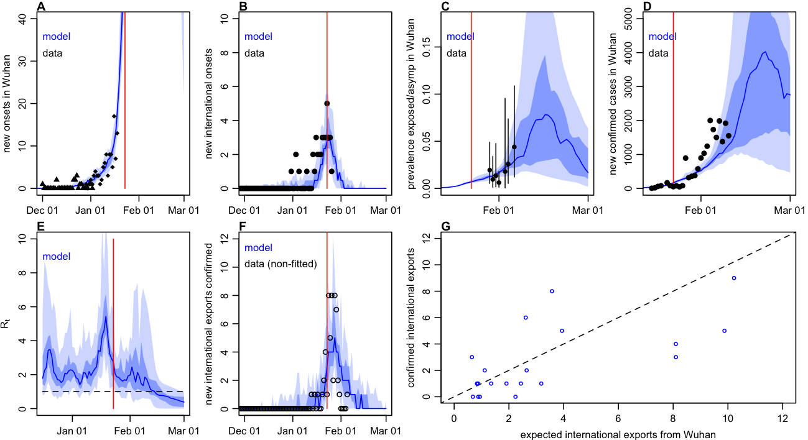

```{r setup, include=FALSE}
knitr::opts_chunk$set(echo = FALSE)
```

*Contributors: Adam Kucharski, Rosalind Eggo, Tim Russell, Charlie Diamond, and the CMMID nCoV analysis group.*

## Summary

• To estimate the early dynamics of transmission and control in Wuhan, we fitted a stochastic transmission model to multiple datasets: temporal data on date of onset of international exported cases from Wuhan; date of onset and confirmed cases in Wuhan. Export rate to different countries was weighted based on the [risk ranking by MOBS lab](https://www.mobs-lab.org/2019ncov.html) - WorldPop have a similar risk ranking (see [Table 5 here](https://www.worldpop.org/events/china)). We considered the 30 countries most at risk in the analysis. The model accounts for delays in symptom onset and reported (see methods below).

• We estimated the reproduction had been fluctuating between 1.5-4 prior to travel restrictions being introduced on 23rd Jan, and found strong evidence R>2 in early January. We found some evidence of a decline in the reproduction number after a peak in early January.

• Our model suggests that exported cases linked to Wuhan will continue to be observed in the coming days, but gradually decline. We have growing uncertainty in our estimates after 23rd Jan because the signal from international cases gets weaker after travel restrictions were introduced.


```{r fig_inference, echo=FALSE, fig.align='center', fig.cap="_Figure: Dynamics of transmission in Wuhan, fitted up to 28th Jan. A) Estimated prevalence of symptomatic cases over time. Red line: travel restrictions imposed on 23rd Jan. B) Estimated reproduction number over time. C) Onset dates of confirmed cases in Wuhan (triangles) and China (circles). D) Estimated internationally exported cases from Wuhan by date of onset (blue) along with reported cases by date of onset (black). E) Cumulative confirmed cases by date in Wuhan. F) Internationally exported cases by date of confirmation. In all figures, blue lines and shaded regions show median, 50% CrI and 95% CrI. Thick black borders show datasets we fitted to. _", out.width = '80%'}

```

## Caveats and ongoing work

• We used biological parameters from current papers, but these may change as we get better data. We also made assumptions about the proportion of people who travel following the methods in the [J-IDEA reports](https://www.imperial.ac.uk/mrc-global-infectious-disease-analysis/news--wuhan-coronavirus/). However, jointly fitting to multiple datasets will reduce the influence that one single dataset has on results.

• We are currently using [risk ranking by MOBS lab](https://www.mobs-lab.org/2019ncov.html) for exported cases, but are also exploring other datasets

• The model is flexible, so we can (and will) incorporate new information and data as it comes available.


## Methods

#### Model

We used a stochastic SEIR model implemented using the Euler-Maruyama algorithm with a 6hr timestep, with transmission rate following geometric brownian motion (i.e. dlog(beta) = s dBt, where s is the volatility of transmission over time). We assume no travel out of Wuhan occurs after 23rd Jan, when restrictions were put in place. 

```{r fig_schematic, echo=FALSE, fig.align='center', fig.cap="_Figure: Model schematic. The population is divided into susceptible-exposed-infectious-removed, with a fraction of exposed individuals subsequently travelling and eventually being detected in their destination country_", out.width = '40%'}
knitr::include_graphics("../plots/schematic.png")
```

#### Fitting

We estimated the time varying reproduction using sequential Monte Carlo by jointly fitting to three datasets (see table below for references): 
1. Daily incidence of exported cases from Wuhan (or lack thereof) in countries with high connectivity to Wuhan (i.e. top 30 most at risk), by date of onset. Source: [WHO](https://www.who.int/docs/default-source/coronaviruse/situation-reports/20200126-sitrep-6-2019--ncov.pdf) 
1. Daily incidence of exported cases from Wuhan (or lack thereof) in countries with high connectivity to Wuhan (i.e. top 30 most at risk), by date of confirmation. Source: News reports, WHO, [Kraemer et al data repo](https://docs.google.com/spreadsheets/d/1itaohdPiAeniCXNlntNztZ_oRvjh0HsGuJXUJWET008/edit?usp=sharing)
1. Daily incidence of initial cases in Wuhan with no market exposure, by date of onset. Source: [Huang et al](https://www.thelancet.com/journals/lancet/article/PIIS0140-6736(20)30183-5/fulltext) 
1. Daily incidence of early cases in China, by date of onset. We assume that these are all in Wuhan. Source: [Liu et al](https://www.biorxiv.org/content/10.1101/2020.01.25.919787v1), [HKU](https://www.med.hku.hk/f/news/3549/7418/Wuhan-coronavirus-outbreak_AN-UPDATE_20200127.pdf)
1. _Validation dataset (not used for fitting): Daily incidence of cases in Wuhan, by date of confirmation. Source: [HKU](https://www.med.hku.hk/f/news/3549/7418/Wuhan-coronavirus-outbreak_AN-UPDATE_20200127.pdf)_

We used a Poisson observation model with different relative reporting probability for cases inside and outside of Wuhan, and only a fraction of cases having known onset dates. Plots were generated by running 200 repetitions of SMC with 2000 particles. The volatility and reporting parameters were selected based on a grid search to find the maximum likelihood. We assumed the outbreak started on 15th November with 10 infectious individuals and 10 in their incubation period. We also assume all infectious people become symptomatic and would be eventually be detected in destination country if they travelled by plane. We assumed that the population at risk was 10m (rather than 19m assumed in Imperial analysis) because most cases to date are adults and this group are more likely to travel.

#### Parameters

Parameters used in the model are as follows. Durations within the E and I compartments are Erlang distributed with rate 2.

| Parameter      | Value | Distribution | Source
| ----------- | ----------- | ----------- | ----------- |
| Incubation period      | 4.8 days       | Erlang (rate=2) | [Liu et al](https://www.biorxiv.org/content/10.1101/2020.01.25.919787v1)
| Infectious period   | 2.9 days        | Erlang (rate=2) | [Liu et al](https://www.biorxiv.org/content/10.1101/2020.01.25.919787v1), [Kraemer](http://virological.org/t/epidemiological-data-from-the-ncov-2019-outbreak-early-descriptions-from-publicly-available-data/337)
| Delay onset-to-confirmation  | 6.1 days        | Exponential | [Kraemer](http://virological.org/t/epidemiological-data-from-the-ncov-2019-outbreak-early-descriptions-from-publicly-available-data/337)
| Daily outbound passengers   | 3300        | - | [J-IDEA](https://www.imperial.ac.uk/mrc-global-infectious-disease-analysis/news--wuhan-coronavirus/)
| Population at risk   | 10m        | - | [J-IDEA](https://www.imperial.ac.uk/mrc-global-infectious-disease-analysis/news--wuhan-coronavirus/)
| Initial cases   | 1        | - | [Andersen](http://virological.org/t/clock-and-tmrca-based-on-27-genomes/347)
| Introduction date  | 2019-12-02        | - | [Andersen](http://virological.org/t/clock-and-tmrca-based-on-27-genomes/347)
| Proportion of cases with onsets known   | 0.15     | - | [Kraemer et al data repo](https://docs.google.com/spreadsheets/d/1itaohdPiAeniCXNlntNztZ_oRvjh0HsGuJXUJWET008/edit?usp=sharing)
| Relative reporting outside of Wuhan   | 170     | - | Estimated
| Transmission volatility   | 0.5        | - | Estimated


