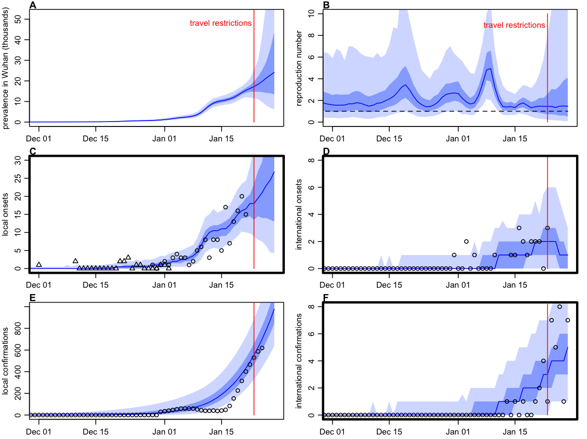
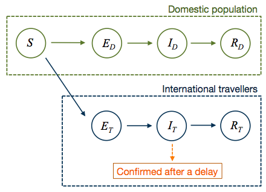

```{r setup, include=FALSE}
knitr::opts_chunk$set(echo = FALSE)
```

*Contributors: Adam Kucharski, Rosalind Eggo, Tim Russell, Charlie Diamond, and CMMID nCoV team.*
*Note: this is preliminary analysis and has not yet been peer-reviewed.*

## Aim

To understand how human-to-human transmission varied in Wuhan during the early stages of the 2019-2020 nCoV outbreak.

## Methods summary

• To estimate the early dynamics of transmission in Wuhan, we fitted a mathematical model to multiple available datasets on international exported cases from Wuhan and cases in Wuhan. Fitting to multiple data sources rather than a single dataset (or data point) is particularly useful for estimates in real-time, because some datasets may be unreliable. 

• Transmission was a random process in the model, and could vary over time -- this means the model can uncover fluctuations in transmission during the early stages of the outbreak. Our group previously used a similar analysis to understand the dynamics of [Ebola in Liberia](https://www.ncbi.nlm.nih.gov/pmc/articles/PMC5394640/).

• We assumed that the chance of cases being exported from Wuhan to other countries depended on the number of cases in Wuhan, the number of outbound travellers (accounting for travel restrictions after 23rd January), and the relative connectivity of different countries. We considered the 30 countries outside China most at risk of exported cases in the analysis. The model accounts for delays in symptom onset and reporting (see methods below).

## Key results

• **We estimated that the effective basic reproduction number, Rt, had likely been fluctuating between 1.5-5 prior to travel restrictions being introduced on 23rd Jan, and found strong evidence R0 was above 2 in early-January**. We also found evidence of a decline in the reproduction number after a peak in early-January. (The effective reproduction number is the average number of secondary cases generated by a typical infectious individual at a given point in time).

• Our model suggests that **exported cases linked to Wuhan will continue to be observed in the coming days, but gradually decline**. We have growing uncertainty in our estimates after 23rd Jan because the signal from international cases gets weaker after travel restrictions were introduced.


```{r fig_inference, echo=FALSE, fig.align='center', fig.cap="_Figure 1: Dynamics of transmission in Wuhan, fitted up to 28th Jan. A) Estimated prevalence of symptomatic cases over time. Red line: travel restrictions imposed on 23rd Jan. B) Estimated effective reproduction number over time. C) Onset dates of confirmed cases in Wuhan (triangles) and China (circles). D) Estimated internationally exported cases from Wuhan by date of onset (blue) along with reported cases by date of onset (black). E) Cumulative confirmed cases by date in Wuhan. F) Internationally exported cases by date of confirmation. In all figures, blue lines and shaded regions show median, 50% CrI and 95% CrI. Datasets that were fitted to shown as solid points; other data shown as circles. _", out.width = '80%'}

```

## Discussion, caveats and ongoing work

• We used biological parameters from current papers, but these may change as we get better data. We also made assumptions about the proportion of people who travel following the methods in the [J-IDEA reports](https://www.imperial.ac.uk/mrc-global-infectious-disease-analysis/news--wuhan-coronavirus/). However, jointly fitting to multiple datasets will reduce the influence that one single dataset has on results.

• The cumulative case totals in Figure 1E should in theory only increase over time; the drop seen in early case is likely the result of reclassification of cases.

• We are currently using [connectivity estimates from MOBS lab](https://www.mobs-lab.org/2019ncov.html) for exported cases, but are also exploring other datasets.

• We omitted the two most recent data points in the onset datasets when fitting the model, as these were likely to be strongly influenced by reporting delays. However, we obtained similar results when the four most recent data points were omitted.

• The model is flexible, and this page will be updated as we incorporate new information and data.


## Detailed methods

#### Model

We used a stochastic SEIR model implemented using the Euler-Maruyama algorithm with a 6hr timestep, with transmission rate following geometric brownian motion (i.e. dlog(beta) = s dBt, where s is the volatility of transmission over time). We assume no travel out of Wuhan occurs after 23rd Jan, when restrictions were put in place. Cases that travel were distributed among other countries based on [risk inferred from connectivity to those countries](https://www.mobs-lab.org/2019ncov.html).

```{r fig_schematic, echo=FALSE, fig.align='center', fig.cap="_Figure 2: Model schematic. The population is divided into susceptible-exposed-infectious-removed classes, with a fraction of exposed individuals subsequently travelling and eventually being detected in their destination country_", out.width = '40%'}

```

#### Fitting

We estimated the time-varying reproduction number using sequential Monte Carlo (SMC) by jointly fitting to three datasets:

1. Daily incidence of exported cases from Wuhan (or lack thereof) in countries with high connectivity to Wuhan (i.e. top 30 most at risk), by date of onset.  The most recent two data points are omitted during fitting as they are likely to be strongly influenced by delays in reporting. Source: [WHO](https://www.who.int/docs/default-source/coronaviruse/situation-reports/20200126-sitrep-6-2019--ncov.pdf) 

1. Daily incidence of exported cases from Wuhan (or lack thereof) in countries with high connectivity to Wuhan (i.e. top 30 most at risk), by date of confirmation. Source: News reports, WHO, [Kraemer et al data repo](https://docs.google.com/spreadsheets/d/1itaohdPiAeniCXNlntNztZ_oRvjh0HsGuJXUJWET008/edit?usp=sharing)

1. Daily incidence of initial cases in Wuhan with no market exposure, by date of onset. The most recent data points are omitted during fitting as they are likely to be strongly influenced by delays in reporting.  Source: [Huang et al](https://www.nejm.org/doi/pdf/10.1056/NEJMoa2001316?articleTools=true).

1. _Validation dataset (not used for fitting): Daily incidence of cases in Wuhan, by date of confirmation. Source: [HKU](https://www.med.hku.hk/f/news/3549/7418/Wuhan-coronavirus-outbreak_AN-UPDATE_20200127.pdf)_

To calculate the likelihood, we used a Poisson observation model fitted jointly to multiple model outputs. To calculate the daily expectation for each Poisson observation process, we converted the model (Figure 2) outputs into new case onset and new reported cases inside Wuhan and travelling internationally.  As destination country was known for confirmed exported cases, we used 30 timeseries for cases exported (or not) to most at-risk countries each day and calculated the probability of obtaining each of these datasets given the model outputs. International onset data was not disaggregated by country and so we used the total daily exported cases in our Poisson probability calculation. We assumed a different relative reporting probability for Wuhan cases compared to international cases, as assumed only a proportion of confirmed Wuhan cases had known onset dates (fixed at 0.15 based on [available line list data](http://virological.org/t/epidemiological-data-from-the-ncov-2019-outbreak-early-descriptions-from-publicly-available-data/337)) 


Estimates for time-varying Rt generated by running 200 repetitions of SMC with 1000 particles. The transmission volatility and relative reporting of cases outside Wuhan were selected based on a grid search to find the marginal MLE. We assumed the outbreak started on 15 November with 10 infectious individuals and the population was initially fully susceptible. We also assumed all infectious people eventually became symptomatic and would be eventually be detected in destination country if they travelled by plane. We assumed that the population at risk was 10m (rather than 19m assumed in Imperial analysis) because most cases to date are adults and this group are more likely to travel. Model is available [on GitHub here](https://github.com/adamkucharski/2020-ncov).

#### Parameters

Parameters used in the model are as follows. To improve realism based on early date, we assume the incubation and infectious period are Erlang distributed with rate 2.

| Parameter      | Value | Distribution | Source
| ----------- | ----------- | ----------- | ----------- |
| Incubation period      | 5.2 days       | Erlang (rate=2) | [Li et al](https://www.nejm.org/doi/pdf/10.1056/NEJMoa2001316?articleTools=true)
| Infectious period   | 2.9 days        | Erlang (rate=2) | [Liu et al](https://www.biorxiv.org/content/10.1101/2020.01.25.919787v1), [Xu et al](http://virological.org/t/epidemiological-data-from-the-ncov-2019-outbreak-early-descriptions-from-publicly-available-data/337)
| Delay onset-to-confirmation  | 6.1 days        | Exponential | [Xu et al](http://virological.org/t/epidemiological-data-from-the-ncov-2019-outbreak-early-descriptions-from-publicly-available-data/337)
| Daily outbound passengers   | 3300        | - | [J-IDEA](https://www.imperial.ac.uk/mrc-global-infectious-disease-analysis/news--wuhan-coronavirus/)
| Population at risk   | 10m        | - | [J-IDEA](https://www.imperial.ac.uk/mrc-global-infectious-disease-analysis/news--wuhan-coronavirus/)
| Initial cases   | 1        | - | [Andersen](http://virological.org/t/clock-and-tmrca-based-on-27-genomes/347)
| Introduction date  | 2019-12-02        | - | [Andersen](http://virological.org/t/clock-and-tmrca-based-on-27-genomes/347)
| Proportion of cases with onsets known   | 0.15     | - | [Xu et al](https://github.com/beoutbreakprepared/nCoV2019)
| Relative reporting outside of Wuhan   | 170     | - | Estimated
| Transmission volatility   | 0.5        | - | Estimated


