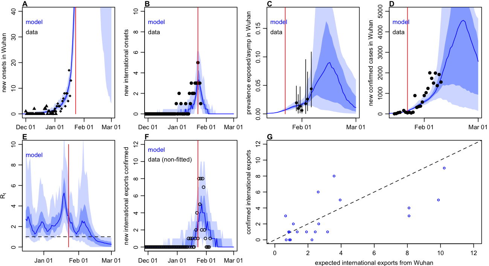

```{r setup, include=FALSE}
knitr::opts_chunk$set(echo = FALSE)
```

*Contributors: Adam Kucharski, Tim Russell, Charlie Diamond, Yang Liu, CMMID nCoV working group, John Edmunds, Sebastian Funk, Rosalind Eggo.*

*Note: **this is preliminary analysis and has not yet been peer-reviewed**. *

## Aim

To understand how human-to-human transmission varied in Wuhan during the early stages of the 2019-2020 nCoV outbreak and project forward based on current trends.

## Methods summary

• To estimate the early dynamics of transmission in Wuhan, we fitted a mathematical model to multiple available datasets on international exported cases from Wuhan and cases in Wuhan. Fitting to multiple data sources rather than a single dataset (or data point) is particularly useful for estimates in real-time, because some datasets may be unreliable. 

• Transmission was a random process in the model, and could vary over time -- this means the model can uncover fluctuations in transmission during the early stages of the outbreak. Our group previously used a similar analysis to understand the dynamics of [Ebola in Liberia](https://www.ncbi.nlm.nih.gov/pmc/articles/PMC5394640/).

• We assumed that the chance of cases being exported from Wuhan to other countries depended on the number of cases in Wuhan, the number of outbound travellers (accounting for travel restrictions after 23rd January), and the relative connectivity of different countries. We considered the 30 countries outside China most at risk of exported cases in the analysis. The model accounts for delays in symptom onset and reporting (see methods below).

## Key results

• **We estimated that the median effective basic reproduction number, Rt, had likely been fluctuating between 1.5-4.5 prior to travel restrictions being introduced on 23rd Jan (Figure 1E)**. (The effective reproduction number is the average number of secondary cases generated by a typical infectious individual at a given point in time).

• **If Rt continues to vary as it has in Wuhan, we projected that the outbreak would peak in mid-to-late-February (Figure 1C-D).** There is substantial uncertainty about what the exact height and timing of the peak might be - currently the model predicts the peak as a result of susceptibility declining to the point where transmission cannot be sustained. As we get more data in the coming days, we will be able to refine these projections.

• **Based on the median reproduction number observed during January before travel restrictions were introduced, we estimated that a single introduction of 2019-nCoV with SARS-like or MERS-like individual-level variation in transmission would have a 20–30% probability of causing a large outbreak**. Assuming SARS-like variation and Wuhan-like transmission, we estimated that once more than three infections have been introduced into a new location, there is an over 50% chance that an outbreak will occur. We have made an [online tool](https://cmmid-lshtm.shinyapps.io/new_outbreak_probability/) so that users can explore scenarios further.


```{r fig_inference, echo=FALSE, fig.align='center', fig.cap="_Figure 1: Dynamics of transmission in Wuhan, fitted up to 28 January 2020. Red line marks travel restrictions starting on 23 January 2020. A) Onset dates of confirmed cases in Wuhan (triangles) and China (diamonds). Blue lines and shaded regions: median of simulated trajectories, 50% and 95% credible intervals of model estimate. B) Reported cases by date of onset (black) and estimated internationally exported cases from Wuhan by date of onset (blue line). C) Estimated prevalence of asymptomatic or pre-symptomatic infections over time in Wuhan, as proportion of population. Black dots show estimated prevalence based on evacuation flights, with 95% binomial CI shown by lines. D) Cumulative confirmed cases by date in Wuhan (points) and estimated cumulative cases (blue line). E) Estimated daily reproduction number (R) over time. F) International exportation events by date of confirmation of case, and expected number of exports in the fitted model G) Expected international exportation events by individual country and observed exports. Datasets that were fitted to shown as solid points; non-fitted data shown as circles. _", out.width = '80%'}

```


## Discussion, caveats and ongoing work

• We assume that the proportion of cases reported during December and January is consistent, but detection may well have changed over time, potentially explaining the differences between model predictions and observed data in Figures 1C and 1F.

• We used biological parameters from current papers, but these may change as we get better data. We also made assumptions about the proportion of people who travel following the methods in the [J-IDEA reports](https://www.imperial.ac.uk/mrc-global-infectious-disease-analysis/news--wuhan-coronavirus/). However, jointly fitting to multiple datasets will reduce the influence that one single dataset has on results.

• We are currently using [connectivity estimates from MOBS lab](https://www.mobs-lab.org/2019ncov.html) for exported cases, but obtained similar results when we fitted to [WorldPop risk estimates](https://www.worldpop.org/events/china).

• The model is flexible, and this page will be updated as we incorporate new information and data.


## Detailed methods

#### Model

We used a stochastic SEIR model implemented using the Euler-Maruyama algorithm with a 6hr timestep, with transmission rate following geometric brownian motion (i.e. dlog(beta) = s dBt, where s is the volatility of transmission over time). We assume no travel out of Wuhan occurs after 23rd Jan, when restrictions were put in place. Cases that travel were distributed among other countries based on [risk inferred from connectivity to those countries](https://www.mobs-lab.org/2019ncov.html).

```{r fig_schematic, echo=FALSE, fig.align='center', fig.cap="_Figure 2: Model schematic. The population is divided into susceptible-exposed-infectious-removed classes, with a fraction of exposed individuals subsequently travelling and eventually being detected in their destination country_", out.width = '40%'}
knitr::include_graphics("../plots/schematic.png")
```

#### Fitting

We estimated the time-varying reproduction number using sequential Monte Carlo (SMC) by jointly fitting to five datasets, with two validation datasets:

1. Daily incidence of exported cases from Wuhan (or lack thereof) in countries with high connectivity to Wuhan (i.e. top 30 most at risk), by date of onset.  The most recent two data points are omitted during fitting as they are likely to be strongly influenced by delays in reporting. Source: [WHO](https://www.who.int/docs/default-source/coronaviruse/situation-reports/20200126-sitrep-6-2019--ncov.pdf) 


1. Daily incidence of initial cases in Wuhan with no market exposure, by date of onset. The most recent data points are omitted during fitting as they are likely to be strongly influenced by delays in reporting.  Source: [Huang et al](https://www.nejm.org/doi/pdf/10.1056/NEJMoa2001316?articleTools=true).

1. Exported infections identified on charter flights to Japan, Germany, Singapore, Malaysia, Italy, Korea and Belgium from Wuhan between  29th Jan and 6th Feb 2020.

1. Daily incidence of confirmed cases in Wuhan, by date of confirmation. Source: [DXY](https://ncov.dxy.cn/ncovh5/view/pneumonia)

1. _Validation dataset (not used for fitting): Daily incidence of exported cases from Wuhan (or lack thereof) in countries with high connectivity to Wuhan (i.e. top 30 most at risk), by date of confirmation. Source: News reports, WHO, [Kraemer et al data repo](https://docs.google.com/spreadsheets/d/1itaohdPiAeniCXNlntNztZ_oRvjh0HsGuJXUJWET008/edit?usp=sharing)_

To calculate the likelihood, we used a Poisson observation model fitted jointly to multiple model outputs for the timeseries data and a binomial likelihood for the prevalence implied by the evacuation flight data. To calculate the daily expectation for each Poisson observation process, we converted the model outputs into new case onset and new reported cases inside Wuhan and travelling internationally.  As destination country was known for confirmed exported cases, we used 30 timeseries for cases exported (or not) to most at-risk countries each day and calculated the probability of obtaining each of these datasets given the model outputs. International onset data was not disaggregated by country and so we used the total daily exported cases in our Poisson probability calculation. We assumed a different relative reporting probability for Wuhan cases compared to international cases, as assumed only a proportion of confirmed Wuhan cases had known onset dates (fixed at 0.16 based on [available line list data](http://virological.org/t/epidemiological-data-from-the-ncov-2019-outbreak-early-descriptions-from-publicly-available-data/337)) 


Estimates for time-varying Rt generated by running 200 repetitions of SMC with 1000 particles. The transmission volatility and relative reporting of cases outside Wuhan were selected based on a grid search to find the marginal MLE. We assumed the outbreak started on 22nd November with 1 infectious individual and the population was initially fully susceptible. We also assumed all infectious people eventually became symptomatic and would be eventually be detected in destination country if they travelled by plane. We assumed that the population at risk in Wuhan was 11m. Model is available [on GitHub here](https://github.com/adamkucharski/2020-ncov).

#### Parameters

Parameters used in the model are as follows. To improve realism based on early data, we assume the incubation and infectious period are Erlang distributed with shape 2.

| Parameter      | Value | Distribution | Source
| ----------- | ----------- | ----------- | ----------- |
| Incubation period      | 5.2 days       | Erlang (shape=2) | [Li et al](https://www.nejm.org/doi/pdf/10.1056/NEJMoa2001316?articleTools=true)
| Infectious period   | 2.9 days        | Erlang (shape=2) | [Liu et al](https://www.biorxiv.org/content/10.1101/2020.01.25.919787v1), [Xu et al](http://virological.org/t/epidemiological-data-from-the-ncov-2019-outbreak-early-descriptions-from-publicly-available-data/337)
| Delay onset-to-confirmation  | 6.1 days        | Exponential | [Xu et al](http://virological.org/t/epidemiological-data-from-the-ncov-2019-outbreak-early-descriptions-from-publicly-available-data/337)
| Daily outbound passengers   | 3300        | - | [J-IDEA](https://www.imperial.ac.uk/mrc-global-infectious-disease-analysis/news--wuhan-coronavirus/)
| Population at risk   | 11m        | - | [J-IDEA](https://www.imperial.ac.uk/mrc-global-infectious-disease-analysis/news--wuhan-coronavirus/)
| Initial cases   | 1        | - | [Andersen](http://virological.org/t/phylodynamic-analysis-55-genomes-04-feb-2020/356)
| Introduction date  | 2019-11-22        | - | [Andersen](http://virological.org/t/phylodynamic-analysis-55-genomes-04-feb-2020/356)
| Proportion of cases with onsets known   | 0.16     | - | [Xu et al](https://github.com/beoutbreakprepared/nCoV2019)
| Relative reporting outside of Wuhan   | 83     | - | Estimated
| Transmission volatility   | 0.5        | - | Estimated


